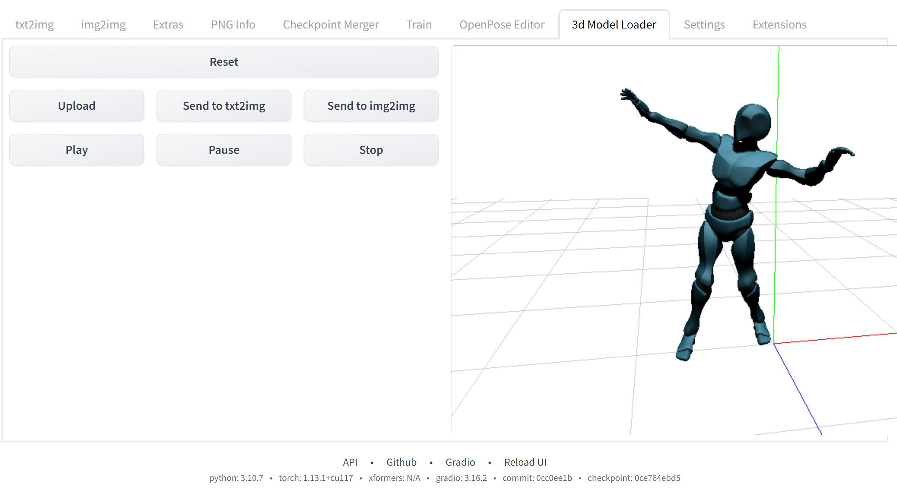
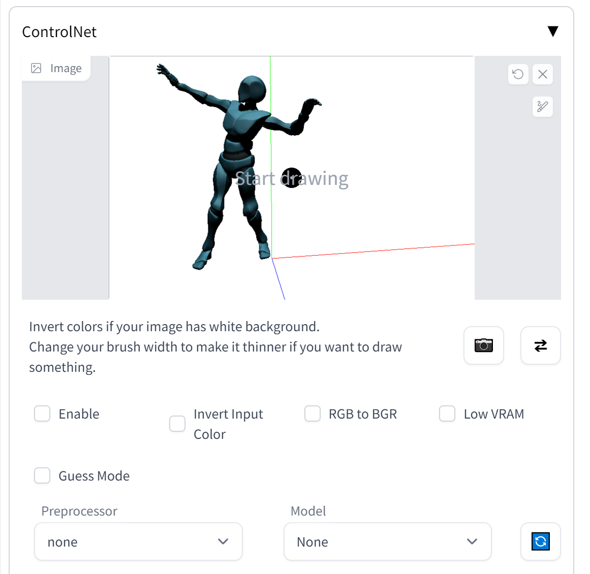

# Stable Diffusion WebUI 3D Model Loader
A custom extension for [AUTOMATIC1111/stable-diffusion-webui](https://github.com/AUTOMATIC1111/stable-diffusion-webui) that allows you to load your local 3D model/animation inside webui, then send screenshot to txt2img or img2img as your ControlNet's reference image.  

## Support formats
Currently, it supports to load three most popular types:
1. obj
2. stl
3. fbx

But it has potential to support more, since threejs supports.
So if you want other formats such as cmt, gltf, just feel free to open an issue, I will add it later.

## Installation
Just like you install other extension of webui:
1. go to Extensions -> Install from URL
2. paste this repo link
3. install
4. go to Installed, apply and restart UI

(I will try to commit it to webui repo soon)

## Settings
Right there are 5 configurations under Settings -> 3D Model:
1. Canvas Background Color -> you can use English color keywords, such white, red, and so on, full color list see threejs doc [here](https://github.com/mrdoob/three.js/blob/f9ae9899444a88a8fe2fcd1b847e9136d4a145bf/build/three.js#L8722)
2. Canvas Width
3. Canvas Height
4. Has Ground
5. Has Axis

After you change any configurations, do not **only** Apply Settings, you also need to go Extensions then click Apply and restart UI to make the settings effect.

## Operation
On the main tab of 3D Model Loader, you can use:
1. **Mouse left button** -> rotate the camera
2. **Mouse wheel** -> zoom in or out
3. **Mouse right button** -> move the camera

there are several buttons on the page:
1. **Rest** -> rest the camera to default position and remove all uploaded objects (There are some issues on this feature, I will fix soon)
2. **Upload** -> upload your 3D model file
3. **Send to txt2img** -> Send the current view of the 3D model on ControlNet in txt2img 
4. **Send to img2img** -> Send the current view of the 3D model on ControlNet in img2img
5. **Play/Pause/Stop** -> control the FBX animation playing

## Gradio.Model3D?
I know gradio has its own 3D model component called **Gradio.Model3D**, but it only supports three formats: obj, glb and gltf, I think it is not enough, at least it should support FBX animation, so I build my own extension.

## Further Plan
Even ThreeJS has superpower to do huge graphic works, such as Light, Texture, and so on.  
However I don't want to rebuild a C4D or Blender inside stable diffusion webui (Actually ThreeJS already has it, called **editor** see [here](https://threejs.org/editor/))
Thus this extension will focus on user experience to give you better reference image from your 3D Model.
